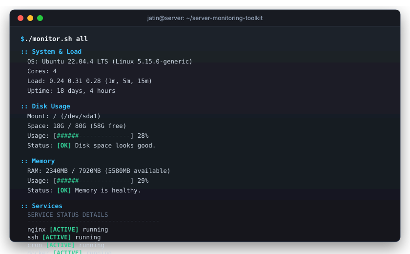

# server-monitoring-toolkit

A lightweight Bash & Web monitoring toolkit to check server health in one place. Instead of SSHing into a box and manually running `df -h`, `free -m`, `uptime`, and checking `systemctl` individually, this pulls the key metrics into a single view — available either in your terminal or via a local web dashboard.

Works on Linux (systemd / SysV) and macOS.



## Quick Start

Make the script executable and run it:

```bash
chmod +x monitor.sh
./monitor.sh
```

Running `./monitor.sh` without arguments launches an interactive terminal menu:

```text
Server Health Monitor (v2.0)
Host: prod-web-01 | Date: 2026-09-13 02:00:15
--------------------------------------------------
Choose an option:
  1) Check disk usage
  2) Check memory (RAM)
  3) Check services
  4) Check CPU & system load
  5) Run all checks
  6) Watch mode (live refresh)
  7) Launch web dashboard
  q) Quit

Select [1-7, q]:
```

## Web Dashboard

For visual monitoring in a browser, start the built-in web dashboard (requires Python 3, zero external packages):

```bash
./monitor.sh web        # Starts dashboard at http://localhost:8080
./monitor.sh web 3000   # Use custom port 3000
```

The web dashboard provides:
- Live gauges for CPU Load, RAM allocation, and Disk capacity.
- Real-time daemon status for background services (`nginx`, `ssh`, `cron`, `docker`).
- Top Running Processes table with interactive sorting by CPU and Memory usage.
- Auto-polling every 3 seconds with a live status indicator.

## CLI Usage

You can also bypass the menu and pass subcommands directly for scripts or quick checks:

```bash
./monitor.sh all        # Run everything in one summary
./monitor.sh disk       # Check root partition usage
./monitor.sh memory     # Check RAM utilization
./monitor.sh services   # Check nginx, ssh, cron, docker
./monitor.sh system     # Check OS, CPU cores, load average, uptime
./monitor.sh watch 2    # Live terminal dashboard (refreshes every 2s)
```

### Example CLI Output

```text
:: System & Load
  OS:      Ubuntu 22.04 LTS
  Cores:   4
  Load:    0.35 0.42 0.38 (1m, 5m, 15m)
  Uptime:  14 days, 3 hours

:: Disk Usage
  Mount:   / (/dev/sda1)
  Space:   18G / 80G (58G free)
  Usage:   [#####---------------]  22%
  Status:  [OK] Disk space looks good.

:: Memory
  RAM:     2140MB / 7920MB (5780MB available)
  Usage:   [#####---------------]  27%
  Status:  [OK] Memory is healthy.

:: Services
  SERVICE        STATUS       DETAILS
  ------------------------------------
  nginx          [ACTIVE]     running
  ssh            [ACTIVE]     running
  cron           [ACTIVE]     running
  docker         [ACTIVE]     running
```

## Checking Custom Services

To check specific services instead of the defaults, pass them as arguments:

```bash
./monitor.sh services postgresql redis apache2
```

## Custom Thresholds

Alert thresholds can be adjusted with environment variables:

```bash
# Warn if disk usage is above 90% or RAM is above 80%
DISK_THRESHOLD=90 MEM_THRESHOLD=80 ./monitor.sh all
```

## How It Works

- **Disk**: Uses `df -P /` so output doesn't wrap on long device names, parses used/free space, and draws a clean progress bar.
- **Memory**: Reads `/proc/meminfo` or `free` on Linux (accounting for buffers and cache). On macOS, it reads `vm_stat` and `sysctl` to calculate active vs available memory.
- **Services**: Uses `systemctl is-active --quiet` if systemd is available. Falls back to `service` (SysV) or process scanning (`pgrep`) if running inside a minimal container or macOS.
- **CPU / Load**: Parses `uptime` load averages and compares 1-minute load against the available core count.
- **Web API**: Built-in HTTP server (`web/server.py`) serving static assets and exposing `/api/stats` as JSON.

## License

MIT
